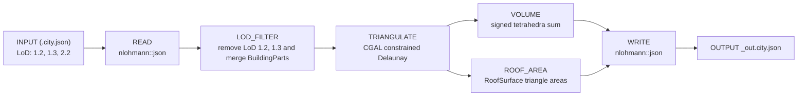

# GEO1004 HW2 — 3D City Model Processing

Arda Baysal – 5484987  
Daman Dogra – 6407196  
Tejas Ziegler – 6575498

A C++ pipeline that processes tiles from the [3DBAG](https://3dbag.nl) dataset.
Given a CityJSON tile, the programme filters to LoD2.2, merges BuildingParts into
their parent Building, triangulates all surfaces, and computes two new per-building
attributes: enclosed volume (`geo1004_volume`) and total roof area
(`geo1004_total_roof_area`).

## Repository structure

```
.
├── report/                    Final report PDF
├── data/                      Input tile and processed output
└── cpp/
    ├── CMakeLists.txt         Build configuration
    ├── include/               Module headers
    │   ├── json.hpp           nlohmann::json (third-party)
    │   ├── lod_filter.h       LoD2.2 filtering and BuildingPart merging
    │   ├── triangulate.h      Surface triangulation via CGAL CDT
    │   ├── volume.h           Per-building volume (signed tetrahedra sum)
    │   └── roof_area.h        Per-building RoofSurface area
    └── src/                   Implementations
        ├── main.cpp           Pipeline orchestration
        ├── lod_filter.cpp
        ├── triangulate.cpp
        ├── volume.cpp
        └── roof_area.cpp
```

## Pipeline



## Dependencies

- C++17
- [CGAL](https://www.cgal.org/)
- [nlohmann/json](https://github.com/nlohmann/json) (included in `include/`)

## Build

```bash
mkdir build && cd build
cmake ..
make
```

## Usage

```bash
./hw2 <input.city.json>
```

Output is written to `<input>_out.city.json`.