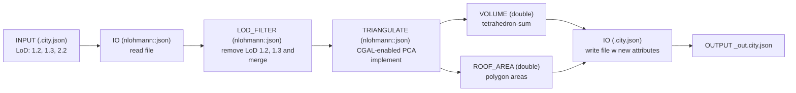

# GEO1004_HW2

```
Arda Baysal – 5484987
Daman Dogra – 6407196
Tejas Ziegler – 6575498
.
├── report/                    Final report PDF
├── data/                      Input tile and its _out output
└── cpp/
    ├── CMakeLists.txt         Build configuration
    ├── include/               Public headers — declarations of each module
    │   ├── json.hpp           nlohmann::json (third-party, untouched)
    │   ├── io.h               CityJSON read/write // unused
    |   ├── lod_filter.h       LoD2.2 filtering
    │   ├── triangulate.h      Surface triangulation via PCA
    │   ├── volume.h           Per-building volume (signed tetrahedra-sum)
    │   └── roof_area.h        Per-building RoofSurface area
    └── src/                   ~Implementations~
        ├── main.cpp           orchestrates the pipeline
        ├── io.cpp             // unused
        ├── triangulate.cpp
        ├── volume.cpp
        ├── lod_filter.cpp
        └── roof_area.cpp
        
```


