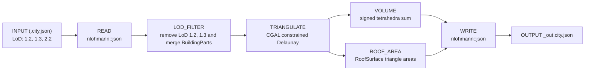

# GEO1004 HW2 — 3D City Model Processing

Arda Baysal – 5484987  
Daman Dogra – 6407196  
Tejas Ziegler – 6575498

A C++ pipeline that processes tiles from the [3DBAG](https://3dbag.nl) dataset.
Given a CityJSON tile, the programme filters to LoD2.2, merges BuildingParts into
their parent Building, triangulates all surfaces, and computes two new per-building
attributes: enclosed volume (`geo1004_volume`) and total roof area
(`geo1004_total_roof_area`).

## Repository structure

```
.
├── report/                    Final report PDF
│   ├── 3d_mod_assig2.pdf      
├── data/
│   ├── 9-284-556.city.json          Input tile (3DBAG, LoD1.2 + LoD1.3 + LoD2.2)
│   ├── 9-284-556_out.city.json      Processed output (LoD2.2 only, triangulated, with volume and roof area attributes)
│   └── generate_synthetic_city.py  Generates synthetic CityJSON cities with analytically known ground truth
├── cpp/
│   ├── CMakeLists.txt         Build configuration
│   ├── include/               Module headers
│   │   ├── json.hpp           nlohmann::json (third-party)
│   │   ├── lod_filter.h       LoD2.2 filtering and BuildingPart merging
│   │   ├── triangulate.h      Surface triangulation via CGAL CDT
│   │   ├── volume.h           Per-building volume (signed tetrahedra sum)
│   │   └── roof_area.h        Per-building RoofSurface area
│   └── src/                   Implementations
│       ├── main.cpp           Pipeline orchestration
│       ├── lod_filter.cpp
│       ├── triangulate.cpp
│       ├── volume.cpp
│       └── roof_area.cpp
├── .gitignore
└── README.md
```

## Pipeline



## Synthetic city generation

`data/generate_synthetic_city.py` generates synthetic CityJSON 2.0 cities with analytically known ground truth for volume and roof area. Used to validate the pipeline under ideal conditions (manifold, disjoint geometries). Supports flat box, gabled, hip, and L-shaped buildings.

```bash
python data/generate_synthetic_city.py -n 20 --seed 7
python data/generate_synthetic_city.py -n 20 --seed 13
python data/generate_synthetic_city.py -n 20 --seed 42
python data/generate_synthetic_city.py -n 20 --seed 69
```

Output is written to `synthetic_city_<seed>.city.json`.

## Dependencies

- C++11
- [CGAL](https://www.cgal.org/)
- [Eigen3](https://eigen.tuxfamily.org/)
- [nlohmann/json](https://github.com/nlohmann/json) (included in `include/`)

## Build

```bash
cd cpp
mkdir build && cd build
cmake ..
cmake --build .
```

## Usage

```bash
.\build\geo1004_hw2.exe <path\to\input.city.json>
```

For example:
```bash
.\build\geo1004_hw2.exe data\9-284-556.city.json
```

The output is written to `<input>_out.city.json` in the same directory as the input file. If no argument is given, the programme defaults to `..\9-284-556.city.json`.
